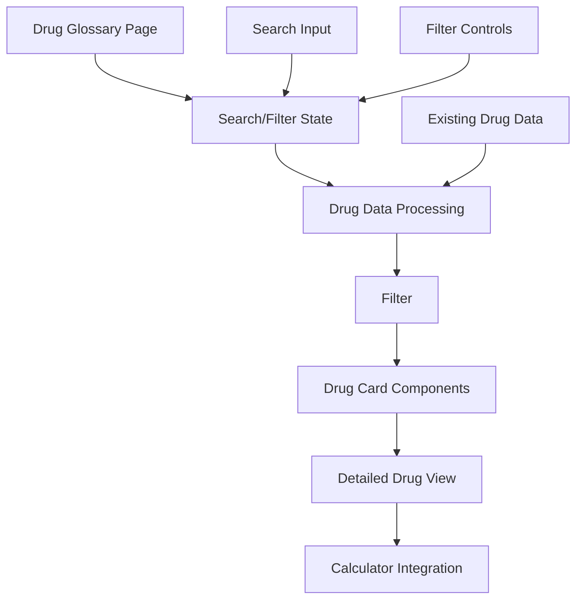

# Design Document

## Overview

The Drug Glossary feature will provide a comprehensive medication database interface that allows healthcare professionals to search, filter, and view detailed information about all available medications in the system. This feature will complement the existing quick reference homepage and dose calculator by providing in-depth drug information including indications, contraindications, dosing guidelines, and clinical notes.

The glossary will be implemented as a new page in the Next.js application, accessible through the main navigation. It will leverage the existing drug data structure while providing enhanced search and filtering capabilities that go beyond the current quick reference functionality.

## Architecture

### Page Structure
- **Route**: `/glossary` - New page in the Next.js App Router
- **Navigation**: Add "Glossary" item to the bottom navigation bar
- **Layout**: Responsive design following existing application patterns

### Data Flow


### State Management
- **Local Component State**: Search queries, filter selections, view modes
- **Existing Drug Data**: Leverage `allDrugData` from `src/lib/drug-categories/index.ts`
- **No Additional Global State**: Keep state local to the glossary feature

## Components and Interfaces

### Core Components

#### 1. DrugGlossaryPage
```typescript
// Main page component
interface DrugGlossaryPageProps {}

// Manages overall page state and layout
// Coordinates search, filtering, and display
```

#### 2. GlossarySearchBar
```typescript
interface GlossarySearchBarProps {
  searchQuery: string
  onSearchChange: (query: string) => void
  placeholder?: string
}

// Real-time search input with debouncing
// Searches across drug names, aliases, and indications
```

#### 3. GlossaryFilters
```typescript
interface GlossaryFiltersProps {
  selectedCategories: string[]
  selectedComplaintTags: string[]
  onCategoryChange: (categories: string[]) => void
  onComplaintTagChange: (tags: string[]) => void
}

// Multi-select filters for categories and complaint tags
// Mobile-responsive filter interface
```

#### 4. DrugGlossaryCard
```typescript
interface DrugGlossaryCardProps {
  drug: Drug
  searchQuery?: string
  onViewDetails: (drugId: string) => void
  onCalculateDose: (drugId: string) => void
}

// Compact drug information display
// Highlights search matches
// Quick action buttons
```

#### 5. DrugDetailModal
```typescript
interface DrugDetailModalProps {
  drug: Drug | null
  isOpen: boolean
  onClose: () => void
  onCalculateDose: (drugId: string) => void
}

// Comprehensive drug information display
// Modal or slide-over interface
// Integration with calculator
```

### Data Processing Utilities

#### 1. Drug Search Engine
```typescript
interface SearchOptions {
  query: string
  categories?: string[]
  complaintTags?: string[]
  includeAliases?: boolean
  includeIndications?: boolean
}

function searchDrugs(drugs: Drug[], options: SearchOptions): Drug[]

// Fuzzy search across multiple fields
// Weighted relevance scoring
// Performance optimized for real-time search
```

#### 2. Filter Engine
```typescript
interface FilterOptions {
  categories: string[]
  complaintTags: string[]
  routes?: Route[]
  audiences?: Audience[]
}

function filterDrugs(drugs: Drug[], filters: FilterOptions): Drug[]

// Multi-criteria filtering
// Efficient array operations
// Maintains search context
```

#### 3. Drug Information Formatter
```typescript
interface FormattedDrugInfo {
  basicInfo: {
    name: string
    aliases: string[]
    categories: string[]
  }
  indications: string[]
  contraindications: string[]
  dosingInfo: {
    pediatric: DosingProfileGroup[]
    adult: DosingProfileGroup[]
  }
  clinicalNotes: string[]
  references: DrugReferences
}

function formatDrugInfo(drug: Drug): FormattedDrugInfo

// Structured drug information presentation
// Separates pediatric and adult dosing
// Formats clinical information for display
```

## Data Models

### Extended Drug Information
The existing `Drug` interface will be enhanced with additional fields for comprehensive glossary display:

```typescript
// Extend existing Drug type with glossary-specific fields
interface GlossaryDrugInfo extends Drug {
  // Additional fields for comprehensive display
  contraindications?: string[]
  precautions?: string[]
  adverseEffects?: string[]
  drugInteractions?: string[]
  pregnancyCategory?: string
  lactationSafety?: string
  mechanismOfAction?: string
  pharmacokinetics?: {
    absorption?: string
    distribution?: string
    metabolism?: string
    elimination?: string
  }
}
```

### Search and Filter State
```typescript
interface GlossaryState {
  searchQuery: string
  selectedCategories: string[]
  selectedComplaintTags: string[]
  selectedRoutes: Route[]
  selectedAudiences: Audience[]
  sortBy: 'name' | 'category' | 'relevance'
  viewMode: 'grid' | 'list'
  selectedDrug: string | null
}
```

### Search Result
```typescript
interface SearchResult {
  drug: Drug
  relevanceScore: number
  matchedFields: string[]
  highlightedName: string
}
```

## Error Handling

### Search Performance
- **Debounced Search**: 300ms delay to prevent excessive API calls
- **Result Limiting**: Maximum 100 results displayed at once
- **Loading States**: Skeleton components during search operations
- **Empty States**: Clear messaging when no results found

### Data Validation
- **Drug Data Integrity**: Validate drug objects on load
- **Search Input Sanitization**: Prevent XSS and injection attacks
- **Filter Validation**: Ensure valid filter combinations

### Error Boundaries
```typescript
// Wrap glossary components in error boundaries
interface GlossaryErrorBoundaryState {
  hasError: boolean
  errorMessage: string
}

// Graceful degradation when drug data is unavailable
// Fallback to basic drug list without advanced features
```

## Testing Strategy

### Unit Tests
- **Search Engine**: Test search accuracy and performance
- **Filter Logic**: Verify multi-criteria filtering
- **Data Formatting**: Ensure consistent drug information display
- **Component Rendering**: Test all component states and props

### Integration Tests
- **Search + Filter Interaction**: Combined search and filtering scenarios
- **Navigation Integration**: Links to calculator and other pages
- **Mobile Responsiveness**: Touch interactions and responsive layouts
- **Performance**: Search response times and memory usage

### End-to-End Tests
- **Complete User Workflows**: Search → Filter → View Details → Calculate Dose
- **Cross-Browser Compatibility**: Ensure consistent behavior
- **Accessibility**: Screen reader navigation and keyboard controls
- **PWA Functionality**: Offline search capabilities

### Performance Testing
```typescript
// Performance benchmarks
interface PerformanceMetrics {
  searchResponseTime: number // < 100ms target
  filterResponseTime: number // < 50ms target
  initialLoadTime: number // < 2s target
  memoryUsage: number // Monitor for memory leaks
}
```

## Implementation Phases

### Phase 1: Core Infrastructure
1. Create glossary page route and basic layout
2. Implement search engine with basic text matching
3. Create drug card component with essential information
4. Add navigation integration

### Phase 2: Advanced Features
1. Implement multi-criteria filtering system
2. Add detailed drug modal/view
3. Integrate with existing calculator
4. Implement responsive design patterns

### Phase 3: Enhancement and Optimization
1. Add fuzzy search and relevance scoring
2. Implement performance optimizations
3. Add advanced sorting options
4. Enhance mobile user experience

### Phase 4: Integration and Polish
1. Add comprehensive error handling
2. Implement accessibility features
3. Add offline search capabilities
4. Performance testing and optimization

## Technical Considerations

### Performance Optimization
- **Virtual Scrolling**: For large drug lists (if needed)
- **Memoization**: Cache search results and filter operations
- **Code Splitting**: Lazy load glossary components
- **Search Indexing**: Pre-process drug data for faster searches

### Accessibility
- **Keyboard Navigation**: Full keyboard support for all interactions
- **Screen Reader Support**: Proper ARIA labels and descriptions
- **Focus Management**: Logical tab order and focus indicators
- **Color Contrast**: Ensure WCAG AA compliance

### Mobile Optimization
- **Touch Targets**: Minimum 44px touch targets
- **Responsive Typography**: Scalable text for different screen sizes
- **Gesture Support**: Swipe gestures for navigation
- **Performance**: Optimized for mobile network conditions

### SEO and Metadata
- **Dynamic Meta Tags**: Drug-specific metadata for deep links
- **Structured Data**: Schema.org markup for medical information
- **URL Structure**: SEO-friendly URLs for individual drugs
- **Sitemap Integration**: Include glossary pages in sitemap
